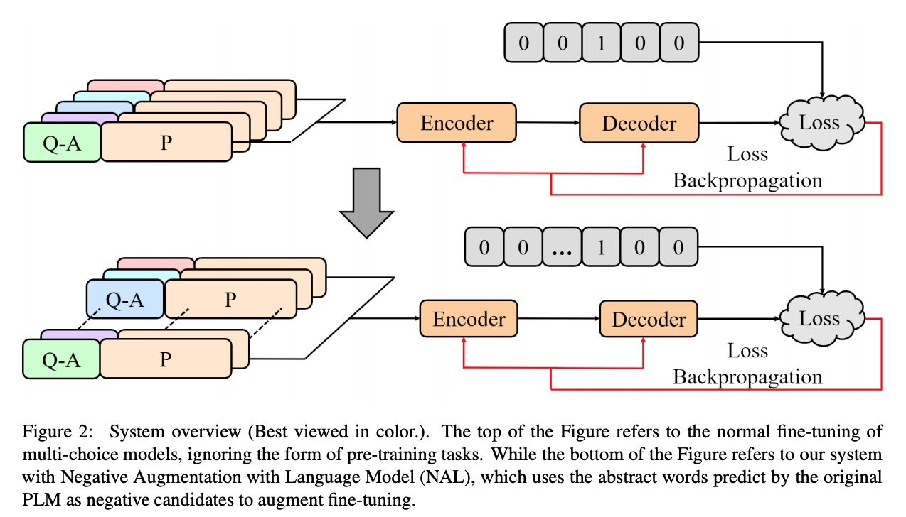
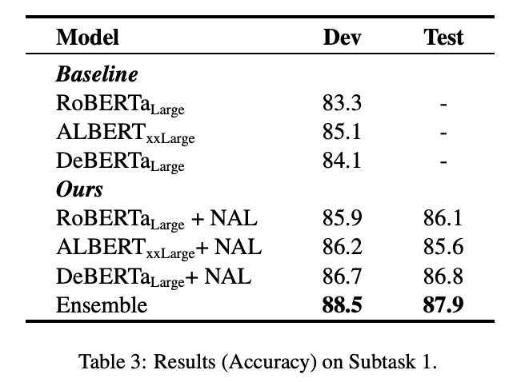
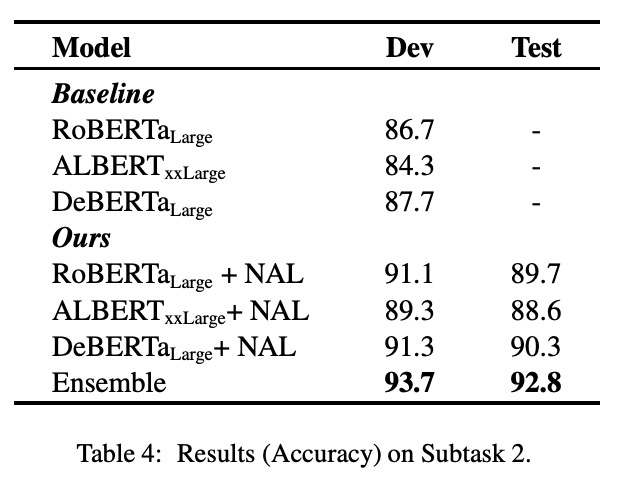

[**中文**](https://github.com/zjunlp/SemEval2021Task4/blob/main/README_CN.md) | [**English**](https://github.com/zjunlp/SemEval2021Task4/)


<p align="center">
    <a href="https://github.com/zjunlp/openue"> </a>
</p>
<p align="center">
    <strong>ZJUKLAB at SemEval-2021 Task 4: Negative Augmentation with Language Model for Reading Comprehension of Abstract Meaning</strong>
</p>


# ZJUKLAB at SemEval-2021 Task 4: Negative Augmentation with Language Model for Reading Comprehension of Abstract Meaning

This repository is the official implementation of the ACL 2021 (Semeval Workshop) paper [ZJUKLAB at SemEval-2021 Task 4: Negative Augmentation with Language Model for Reading Comprehension of Abstract Meaning](https://arxiv.org/pdf/2102.12828.pdf) which is the 4th rank system of [the SemEval 2021 Task4](https://competitions.codalab.org/competitions/26153).



## Contributors

Student: Xin Xie, Nanxiang Chen, Xiang Chen and so on

Supervisor: Ningyu Zhang, Huajun Chen.

## Requirements

To install requirements:

* python >= 3.7

* torch >= 1.6

* transformers==3.3.1

```setup
pip install -r requirements.txt
```

## preprocess

To get the NAL answers, we use the models without fine-tuning to get the enhanced dataset.

```
python ./dataset/preprocess.py
```

## Training

### post-training

Firstly, pretrain the `ALBERT`,`RoBERTa` models to fit the in-domain text.

```
./scripts/pretrain_model.sh
```

### fine-tuning

Secondly, fine-tuning the model with the followed scripts.

```
./scripts/run_deberta.sh
./scripts/run_albert.sh
./scripts/run_roberta.sh
```

### ensemble

Finally, we get the best model files and ensemble them with weighted voting (weighted by the acc at dev set).

```
./scripts/get_answer/save_answer.sh
```

## Evaluation

run the command below to get the result files. 

```shell
./scripts/get_answer/save_answer.sh
```

## Results

Our model achieves the following performance on :






## Papers for the Project & How to Cite

If you use or extend our work, please cite the following paper:

```
@article{xie2021zjuklab,
  title={ZJUKLAB at SemEval-2021 Task 4: Negative Augmentation with Language Model for Reading Comprehension of Abstract Meaning},
  author={Xie, Xin and Chen, Xiangnan and Chen, Xiang and Wang, Yong and Zhang, Ningyu and Deng, Shumin and Chen, Huajun},
  journal={arXiv preprint arXiv:2102.12828},
  year={2021}
}
```


## Contributing

>📋  Pick a licence and describe how to contribute to your code repository. 