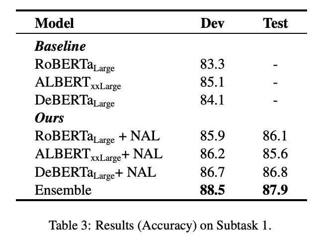

[**中文**](https://github.com/zjunlp/SemEval2021Task4/blob/main/README_CN.md) | [**English**](https://github.com/zjunlp/SemEval2021Task4/)


<p align="center">
    <a href="https://github.com/zjunlp/openue"> </a>
</p>
<p align="center">
    <strong>SemEval2021Task4 抽象阅读理解任务中的使用MLM任务增强魔性训练</strong>
</p>


# SemEval2021Task4 抽象阅读理解任务中的使用MLM任务增强魔性训练

这是针对我们项目[SemEval2021Task4](https://github.com/zjunlp/SemEval2021Task4)的官方实现代码。


## 项目成员
学生：谢辛，陈湘楠 ，陈想。指导老师：张宁豫，陈华钧


## 环境要求

需要按以下命令去配置项目运行环境：

* python >= 3.7

* torch >= 1.6

* transformers==3.3.1

```运行准备
pip install -r requirements.txt
```


## 运行代码

## preprocess

我们使用未经下游fine-tune的模型来做NAL进行数据增强。

```
python ./dataset/preprocess.py
```

## Training

### post-training

首先进行模型领域自适应预训练任务。

```
./scripts/pretrain_model.sh
```

### fine-tuning

其次，在下游任务上进行fine-tune。

```
./scripts/run_deberta.sh
./scripts/run_albert.sh
./scripts/run_roberta.sh
```

### 模型融合

最终我们使用dev集上的分数进行加权模型融合。

```
./scripts/get_answer/save_answer.sh
```

## 评估效果

请运行以下命令来评估项目模型的效果：

```评估
./scripts/get_answer/save_answer.sh
```

## 结果

我们的模型达到了以下的性能：




## 有关论文

如果使用我们的代码，请使用以下bibtex引用论文。

```
@article{xie2021zjuklab,
  title={ZJUKLAB at SemEval-2021 Task 4: Negative Augmentation with Language Model for Reading Comprehension of Abstract Meaning},
  author={Xie, Xin and Chen, Xiangnan and Chen, Xiang and Wang, Yong and Zhang, Ningyu and Deng, Shumin and Chen, Huajun},
  journal={arXiv preprint arXiv:2102.12828},
  year={2021}
}
```


